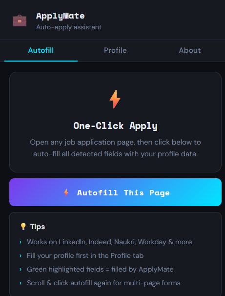
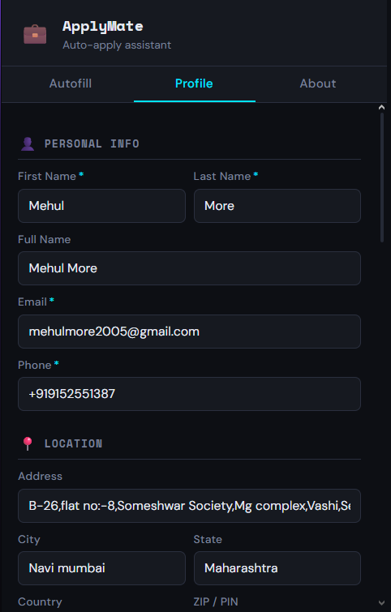
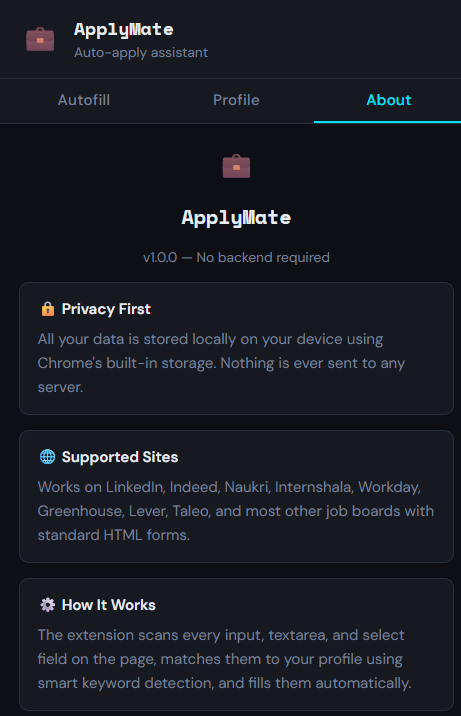

# 💼 ApplyMate — Auto Apply Assistant

> **One-click autofill for any job application website. No backend. No account. 100% local.**

ApplyMate is a Chrome extension that lets you store your profile once and automatically fill job application forms across LinkedIn, Naukri, Workday, Indeed, and hundreds of other job boards — with a single click.

---
📸 Screenshots
<p align="center">
  
  &nbsp;&nbsp;
  
  &nbsp;&nbsp;
  
</p>
<p align="center">
  <em>Autofill Tab &nbsp;&nbsp;&nbsp;&nbsp;&nbsp;&nbsp;&nbsp;&nbsp;&nbsp;&nbsp;&nbsp;&nbsp;&nbsp;&nbsp; Profile Tab &nbsp;&nbsp;&nbsp;&nbsp;&nbsp;&nbsp;&nbsp;&nbsp;&nbsp;&nbsp;&nbsp;&nbsp;&nbsp;&nbsp; About Tab</em>
</p>
---

## ✨ Features

- ⚡ **One-click autofill** — fills all detected fields instantly
- 👤 **Complete profile storage** — personal info, experience, education, skills, salary, links
- 🏢 **Experience entries** — add multiple roles with organization, title, duration, and work type (Onsite / Hybrid / Remote)
- 📄 **Resume upload** — store your PDF or Word resume locally for quick access
- 🔒 **100% private** — all data stored in `chrome.storage.local`, nothing sent to any server
- 🌐 **Works everywhere** — any site using standard HTML form fields

---

## 🌐 Supported Job Sites

| Site | Support |
|------|---------|
| LinkedIn Easy Apply | ✅ |
| Indeed Apply | ✅ |
| Naukri.com | ✅ |
| Internshala | ✅ |
| Workday | ✅ |
| Greenhouse | ✅ |
| Lever | ✅ |
| Taleo | ✅ |
| AngelList / Wellfound | ✅ |
| Any standard HTML form | ✅ |

---

## 🚀 Getting Started

### 1. Clone & install

```bash
git clone https://github.com/mehulm30/applymate-extension.git
cd applymate-extension
npm install
```

### 2. Build

```bash
npm run build
```

This bundles the React popup and runs `scripts/post-build.js` which copies `manifest.json`, `background.js`, and `content.js` into the `build/` folder.

### 3. Load in Chrome

1. Open `chrome://extensions`
2. Enable **Developer mode** (toggle, top-right)
3. Click **Load unpacked**
4. Select the `build/` folder

### 4. Use it

1. Click the **💼 ApplyMate** icon in your Chrome toolbar
2. Go to the **Profile** tab → fill in your details → hit **Save Profile**
3. Open any job application page
4. Click **⚡ Autofill This Page**
5. Green highlighted fields = filled by ApplyMate ✓

---

## 📁 Project Structure

```
applymate-extension/
│
├── public/
│   ├── index.html          # Popup HTML shell
│   ├── manifest.json       # Chrome Manifest v3
│   ├── background.js       # Service worker (message routing)
│   ├── content.js          # Injected into pages (form filling logic)
│   └── icons/              # Extension icons (16, 32, 48, 128px)
│
├── src/
│   ├── App.js              # Main popup UI (Autofill / Profile / About tabs)
│   ├── index.js            # React entry point
│   │
│   ├── components/
│   │   ├── AutofillButton.js     # CTA button with status states
│   │   ├── ExperienceSection.js  # Dynamic experience entry cards
│   │   ├── FormField.js          # Reusable labeled input / textarea
│   │   ├── ResumeUpload.js       # Drag-and-drop resume uploader
│   │   └── SectionHeader.js     # Section divider with icon + label
│   │
│   ├── hooks/
│   │   ├── useAutofill.js   # Sends AUTOFILL_REQUEST to background
│   │   ├── useProfile.js    # Reads/writes profile via chrome.storage
│   │   └── useResume.js     # Reads/writes resume file via chrome.storage
│   │
│   └── styles/
│       └── App.css          # Full popup styling (dark theme)
│
├── scripts/
│   └── post-build.js        # Copies extension files into build/
│
├── package.json
└── README.md
```

---

## 🏗️ How It Works

```
[Popup UI — React]
       │
       │  chrome.runtime.sendMessage({ type: "AUTOFILL_REQUEST" })
       ▼
[background.js — Service Worker]
       │
       │  chrome.tabs.sendMessage({ type: "AUTOFILL_FORM" })
       ▼
[content.js — injected in active tab]
       │
       ├── Scans all <input>, <textarea>, <select> fields
       ├── Matches labels / names / placeholders to profile keys
       ├── Fills matched fields using native value setters
       └── Highlights filled fields in green ✓
```

Profile data flows: **Popup → chrome.storage.local → content script → form fields**

---

## 🔒 Privacy

| Data | Where it lives |
|------|---------------|
| Profile info | `chrome.storage.local` (your device only) |
| Resume file | `chrome.storage.local` as base64 (your device only) |
| Autofill activity | Never logged or stored |
| Any server / API | ❌ None used |

Everything stays on your machine. Uninstalling the extension removes all stored data.

---

## 🛠️ Tech Stack

- **React 18** — popup UI
- **Chrome Manifest v3** — extension platform
- **chrome.storage.local** — all persistence
- **Vanilla JS** — content script (no framework, fast injection)
- **CSS custom properties** — dark theme design system

---

## 🤝 Contributing

Pull requests are welcome! Some ideas for contributions:

- [ ] AI-powered field matching (Claude / OpenAI API)
- [ ] Firefox / Edge support
- [ ] `chrome.storage.sync` for cross-device profile sync
- [ ] Auto-detect multi-page forms and paginate
- [ ] Export / import profile as JSON

---

## 📄 License

MIT © [Mehul](https://github.com/mehulm30)
